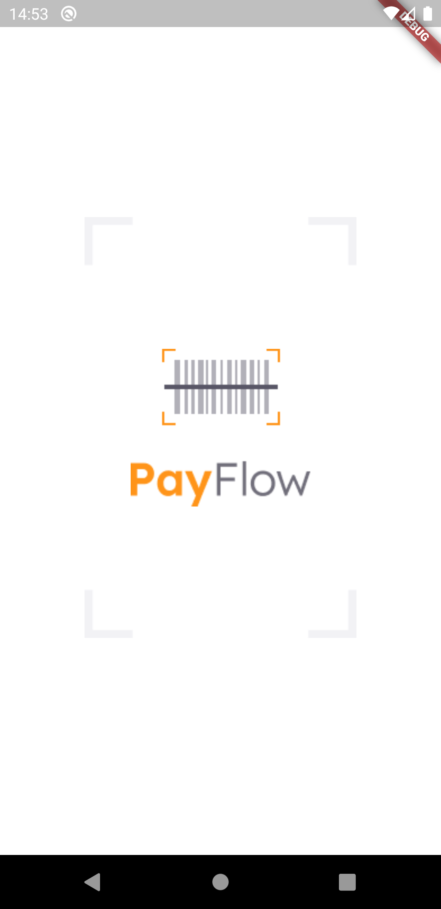

# Payflow

## Descrição

Um app para gerenciamento de boletos, contendo recursos como o uso de câmera e galeria, Machine Leaning com MLKit, Firebase Core e SignIn, Animações e Estilizações Personalizadas, entre vários outros pontos, como o uso do SharedPreferences.

## Tecnologias

As seguintes tecnologias e pacotes foram usadas na construção do projeto:

- [Flutter](https://flutter.dev/)
- [Firebase](https://firebase.google.com/)
- [google_sign_in](https://pub.dev/packages/google_sign_in)
- [google_ml_kit](https://pub.dev/packages/google_ml_kit)
- [shared_preferences](https://pub.dev/packages/shared_preferences)
- [camera](https://pub.dev/packages/camera)
- [image_picker](https://pub.dev/packages/image_picker)
- [font_awesome_flutter](https://pub.dev/packages/font_awesome_flutter)
- [flutter_masked_text2](https://pub.dev/packages/flutter_masked_text2)
- [animated_card](https://pub.dev/packages/animated_card)

## Como Usar

```
- Clone esse repositório:
$ git clone https://github.com/lucas-salles/payflow

- Entre no diretório:
$ cd payflow

- Instale as dependências:
$ flutter pub get

- Inicie o app:
$ flutter run
```

<p flwx-direction="row">
  
   
  
  
  
</p>
